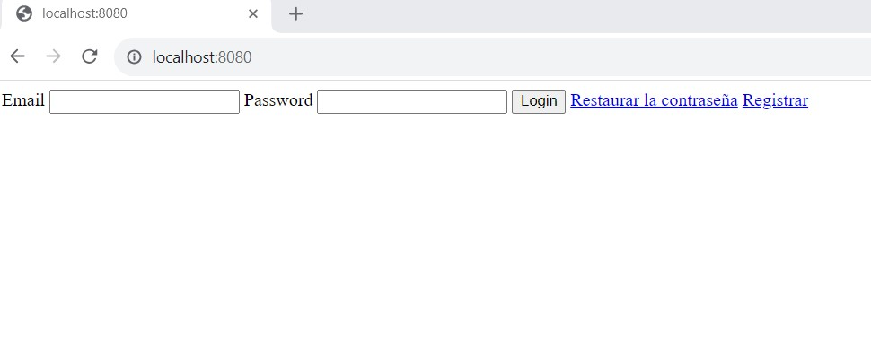
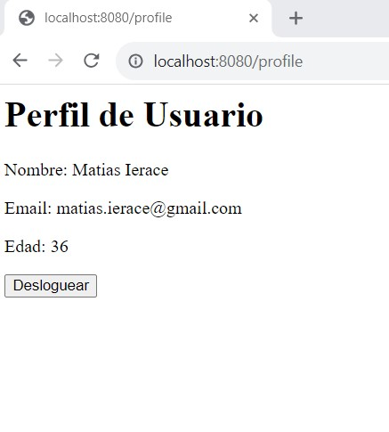
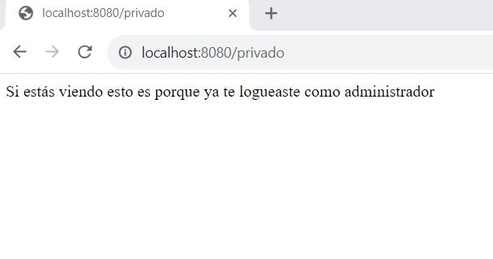
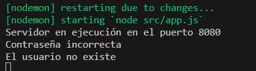
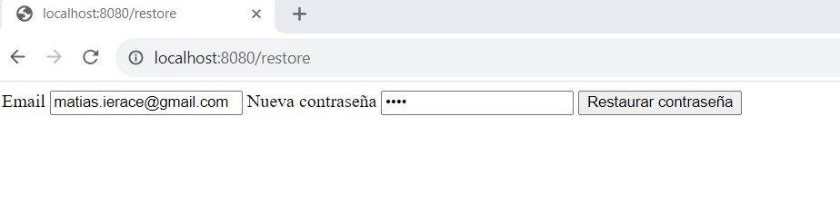

http://localhost:8080/

Es el login de los usuarios, con boton login, enlace para restaurar contraseña y otro para registrar un nuevo usuario

Si el usuario esta registrado ingresa al profile con la opcion de desloguearse y volver al menu de logueo nuevamente

http://localhost:8080/profile

Si el programa detecta que es el Administrador previamente registrado es
Email: adminCoder@coder.com 
Password: 1
Ingresamos a privado que solo el administrador puede ver

http://localhost:8080/privado

Si el mail o contraseña es erroneo tengo mensaje de error y el usuario tiene que poner algo correcto para loguearse, o bien registrarse/restaurar contraseña segun el caso

http://localhost:8080/

Registro de nuevo usuario

http://localhost:8080/register

Recupero de contraseña 

http://localhost:8080/restore

Utilice bcrypt y passport en la implementación de este código